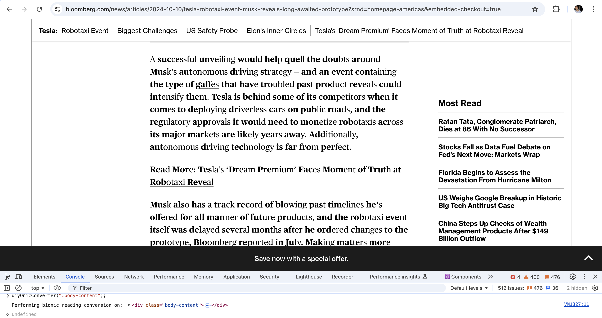

# diyOnicConverter

### implement simple bionic reader

### Usage

```
diyOnicConverter(".content");
diyOnicConverter(".content", 4);
```

### Parameters

- `textContentContainerSelector (string)`: A CSS selector string that identifies the container element whose text content will be converted.
- `staticPrefix (number, optional)`: The number of characters to bold at the start of each word. Defaults to 3.


### Outline

- Select Container: The function selects the container element using the provided CSS selector.
- Process Text Nodes: It traverses the text nodes within the container, processing each word by bolding the specified number of initial characters.
- Replace Text Nodes: The original text nodes are replaced with new nodes containing the formatted text.
- Error Handling: If the container element is not found using the provided selector, an error message is logged to the console.

## Tested on the following websites


